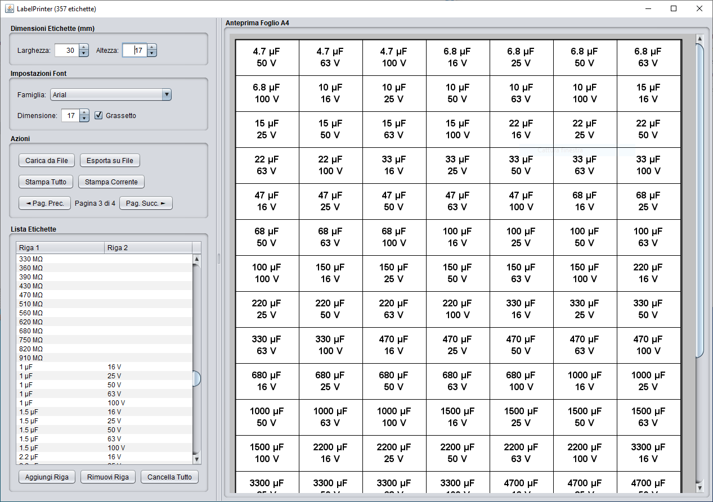

# LabelPrinter

**LabelPrinter** è un'applicazione per creare, gestire e stampare etichette utilizzando fogli adesivi A4. L'interfaccia intuitiva permette di inserire il testo delle etichette, personalizzare dimensioni e font, visualizzare l'anteprima e stampare direttamente su stampanti compatibili.

---

## Caratteristiche principali

- Creazione di etichette con **una o due righe di testo** per ciascuna.
- Personalizzazione delle **dimensioni delle etichette** (larghezza e altezza in millimetri).
- Scelta del **font**, dimensione del testo.
- Anteprima grafica completa del foglio A4 con tutte le etichette.
- Navigazione tra le pagine quando il numero di etichette supera lo spazio disponibile su un foglio.
- Importazione e esportazione di liste di etichette tramite file di testo.
- Stampa di tutte le etichette o della pagina corrente.
- Layout adattato automaticamente alle dimensioni reali dei fogli A4.

---

## Download

Puoi scaricare direttamente il pacchetto **pronto all’uso** senza bisogno di installazione:

- [Scarica LabelPrinter ZIP](https://github.com/manufino/LabelPrinter/releases/download/1.0/LabelPrinter.zip)

